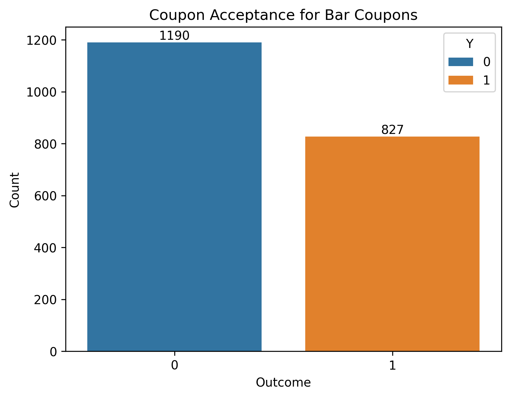

# Coupon Acceptance Rate finding - Will the customer Accept the Coupon?

### Problem statement:  
Distinguish between customers who accepted a driving coupon versus those who did not. It uses probabilty distributions and data visulizations and statistical summary to draw conclusions. 

### Data:

### Findings:
58% percent of the total drivers accepted the coupon. 

Following detailed findings are based on the bar coupon investigation. 
- How many
### Next Steps:

